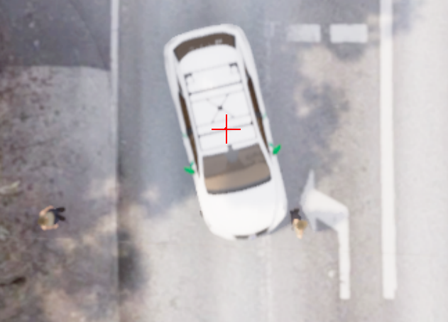
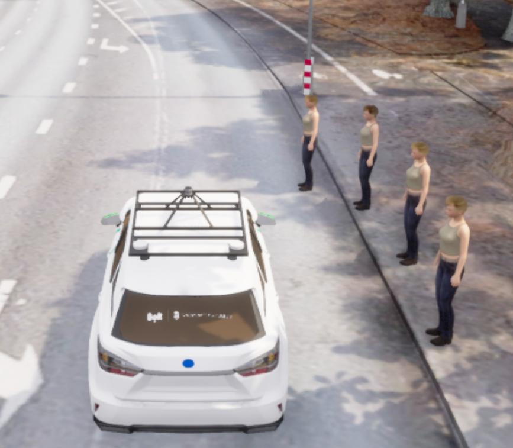
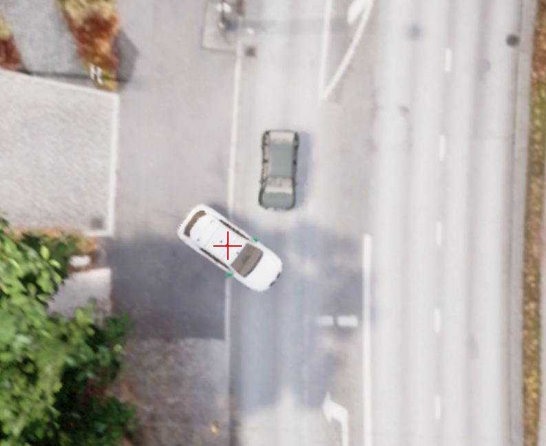

[< Previous lesson](../lesson7/) -- [**Main Readme**](../README.md)

# Lesson 8 - Testing in the CARLA simulator

In this final lesson, you will run the whole framework from the previous lessons in closed loop inside the CARLA simulator: the simulated world reacts to your vehicle, and your vehicle must react to the world.

Two tools are used for the closed-loop validation:
* [**CARLA**](https://carla.org/) - an open-source autonomous driving simulator. It renders the world via provided map files (and we will use our own Tartu map), simulates the physics and the sensors (lidar, cameras), and feeds them to your nodes through ROS topics.
* **Visual Scenario Editor (VSE)** - a graphical tool for creating and re-playing driving scenarios in CARLA: NPC vehicles and pedestrians with routes and triggers, traffic light sequences and weather. See the [VSE repository](https://github.com/UT-ADL/visual-scenario-editor) and [how to use the editor](https://github.com/UT-ADL/visual-scenario-editor/blob/main/tutorial.md).

You will first verify that your framework can drive in CARLA, then run it through a prepared VSE scenario, and finally design scenarios yourself where your framework fails.

### Expected outcome
* Understanding how the full autonomous driving stack behaves in a closed-loop simulation
* Exploring the limits of the framework you built


## 1. Run your stack in CARLA

The launch file [lesson8.launch](launch/lesson8.launch) connects your nodes from the previous lessons to CARLA. There is no bag playback: the localization comes from the simulator, and the vehicle commands from your `pure_pursuit_follower` steer the car in the simulation.

By default the detected objects and traffic light statuses come from the simulator's ground truth instead of your perception nodes - simulating the lidar and the cameras is very heavy, and running the perception pipeline on them can slow the simulation down to a crawl. Your planner and controller are still the ones driving. If your machine can afford it, you can enable your own perception with `detector:=cluster` (lesson 5 nodes on the simulated lidar) and/or `tfl_detector:=yolo` (lesson 7 nodes on the simulated cameras).

##### Instructions
1. Start the CARLA simulator:
    ```
    $CARLA_ROOT/CarlaUE4.sh -prefernvidia -RenderOffScreen
    ```
2. In another terminal, launch your stack:
    ```
    roslaunch autoware_mini_tutorial lesson8.launch
    ```

##### Validation
* RViz opens with the Tartu map and the ego vehicle placed in the simulated city
* The `Carla image view` panel shows the third-person view of the ego vehicle in the simulated world
* Place a goal on the map - the vehicle drives to it


## 2. Run the demo scenario

A driving scenario adds actors to the otherwise empty world: NPC vehicles and pedestrians that spawn, move and react when triggered, and traffic lights that switch according to the scenario triggers. You will run the prepared demo lap scenario and see whether your framework survives traffic.

When your stack is running, VSE automatically detects your ego vehicle and hands the driving over to it - the scenario provides the destination, the other actors and the evaluation.

##### Instructions
1. With `lesson8.launch` running, start VSE and open the `tartu_demo` map. When VSE first launches, it will ask to select the agent's behavior logic. Navigate to `autoware_mini/nodes/platform/carla/` and select `carla_minimal_agent.py`.
2. Open the scenario (`Scenario` menu -> `Open`): `shared/scenarios/tartu_demo_route_simplified.json` from the tutorial folder
3. Press **Play**. Note: if your machine has less than 10 Gb VRAM slowdowns are expected.

##### Validation
* The goal appears in RViz automatically and the vehicle starts driving the demo lap
* NPC vehicles and pedestrians act out the scenario around the ego vehicle
* When the run ends, VSE shows a results window scoring the drive (collisions, red light violations, route completion); the same results are also saved as a text file next to the scenario JSON


## 3. Create three failure cases

Your framework from the previous lessons is a simplified one. Remember all limitations that were discussed through the lessons. In this final task you will demonstrate these limits: create three scenarios where your framework fails.

##### Instructions
1. Copy `tartu_demo_route_simplified.json` (e.g. to `failure_case_1.json`) and modify it in VSE - move, add, retime or reroute actors and triggers until your stack demonstrably fails, while a careful human driver would still manage
2. For every failure case, think of a specific change to the framework that would fix it. You do not need implement the fix. The three cases should have three different proposed fixes.
3. Create a `lesson8/scenarios/` folder in your repository and commit the three scenario JSONs there
4. Fill in the three descriptions below: what happens in the scenario, how your framework fails, and what change to the framework would fix it. Add screenshots if needed.
5. Commit and push everything, and be ready to demonstrate your failure cases at the practice session

##### Failure case 1

Failure:
The vehicle detects a stationary object and initially slows down or stops. However, it later moves forward and collides with the object.

Possible Cause:
The stopping distance or safety buffer around the detected object may be too small. Although the object is detected, the vehicle may stop too close to it or incorrectly determine that it is safe to continue moving.

Proposed Remedy:
Increase the braking safety distance and collision buffer for stationary objects. The vehicle should also continue tracking the object after stopping and only resume movement once the path is confirmed to be clear.

##### Failure case 2

Failure:
The vehicle comes to a complete stop whenever an object slightly overlaps its planned path, even when there is enough free space to safely drive around it.

Possible Cause:
The current system only detects whether an object intersects the vehicle’s path. It does not contain obstacle-avoidance or path-adjustment logic, so stopping is the only available response.

Proposed Remedy:
Add obstacle-avoidance logic that calculates the available free space around the object. When sufficient space is available, the vehicle should generate an alternative path and safely manoeuvre around the obstacle. Otherwise, it should remain stopped.

##### Failure case 3

Failure:
When entering a main lane from a side lane, the vehicle turns without checking for approaching traffic, even though vehicles on the main lane have priority.

Possible Cause:
The system does not currently consider road priority rules or detect conflicts with vehicles travelling along the lane being entered.

Proposed Remedy:
Add right-of-way and intersection-handling logic. When the vehicle is approaching from a lower-priority lane, it should detect approaching vehicles, estimate whether there is a safe gap, and wait until the lane is clear before completing the turn.
